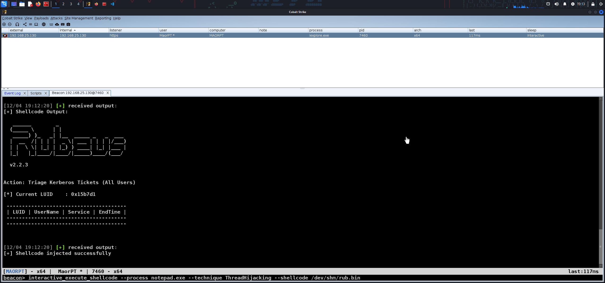

    

> Note: This project is purely academic, use at your own risk. I do not support or condone the illegal use of this software or any form of unauthorized attacks.

## 🛡️ interactive_execute_shellcode 🚀

## 🛡️ How to make shellcode injection interactive? 🚀

This method involves injecting a small piece of code ("shellcode") into a spawned process and then using named pipes to read the standard output (stdout) of that process.

Named pipes are a feature of the operating system that allows two processes to communicate with each other. In this case, we create a named pipe in the memory allocated for the shellcode, and then read the stdout of the process through this pipe.




## 🛡️ The Project 📽️

This project was developed to out of the original usage in sliver of `execute-shellcode` in interactive mode, which I was missing out in Cobalt Strike, thus I wanted to create a BOF to perform a shellcode injection and getting output (for instance, using donut to make a shellcode and injection to another process).

## 🛡️ Features 👾
- Injects shellcode into a specified process.
- Supports multiple techniques for shellcode injection.

## 🛡️ Building the binaries 🗑️
> WARNING: DO NOT RUN interactive_execute_shellcode IN YOUR PERSONAL MACHINE, EXECUTE ONLY IN A TEST ENVIRONMENT!

First, download the project:

```bash
git clone https://github.com/maorsabag/interactive_execute_shellcode
cd interactive_execute_shellcode/interactive-execute-shellcode-BOF
chmod +x build.sh
./build.sh
```

## 🛡️ Loading the .cna into Cobalt Strike

After building the binaries, you can load the .cna script into Cobalt Strike. Here's how:

1. Open Cobalt Strike, go to the `Script Manager` under the `View` menu.
2. Click on `Load`, navigate to the location of your .cna file.
3. Select the .cna file and click `Open`.

Now, the .cna script is loaded into Cobalt Strike and ready to use.

```bash
# Navigate to the directory containing the .cna file
cd path/to/your/cna/file

# Load the .cna file into Cobalt Strike
# This is done manually through the Cobalt Strike GUI
```

## 🛡️ Using the Beacon Object File (BOF) with interactive_execute_shellcode

Here's how to use it:

```bash
# Usage
interactive_execute_shellcode [options]

# Options (specified in any order)
--process <process>            # Specify a process to use for the BOF
--technique <technique>        # Specify which technique to use in the BOF
--shellcode <shellcode file>   # Specify the shellcode file to use

# Example
interactive_execute_shellcode --process notepad.exe --technique NtCreateThreadEx --shellcode shellcode.bin
